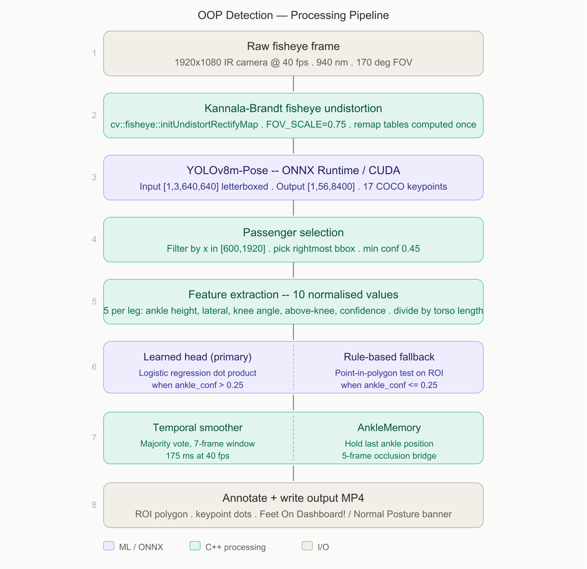

# Out-of-Position (OOP) Detection — 

---

## Overview

This repository implements a real-time Out-of-Position detection system for Euro NCAP Case 1: detecting when a front passenger places one or both feet on the vehicle dashboard (facia).

The system processes video from a 170° fisheye infrared camera (1920×1080 @ 40 fps) mounted near the rearview mirror in a Hyundai Santafe. It outputs annotated video with per-frame labels — **"Feet On Dashboard!"** (red) or **"Normal Posture"** (green) — drawn on every frame.

**Validated performance (leave-one-video-out cross-validation):**

| Metric | Value |
|--------|-------|
| Mean F1 (held-out positive videos) | **0.918** |
| Recall on held-out positive_1 | 0.739 |
| False positive rate (negative videos) | 1.7 % |

---

## Table of Contents

- [System Requirements](#system-requirements)
- [Repository Structure](#repository-structure)
- [Setup Instructions](#setup-instructions)
- [Input Data Layout](#input-data-layout)
- [Running the Solution](#running-the-solution)
- [Step-by-Step (Manual)](#step-by-step-manual)
- [Output](#output)
- [Architecture Summary](#architecture-summary)
- [Key Parameters](#key-parameters)
- [Reproducing Exact Output](#reproducing-exact-output)
- [Troubleshooting](#troubleshooting)

---

## System Requirements

### Hardware
- NVIDIA GPU with CUDA support (tested on RTX 4080)
- 8 GB GPU memory minimum
- 16 GB system RAM recommended

### Software
| Component | Version | Notes |
|-----------|---------|-------|
| Ubuntu | 22.04 or 24.04 | Linux only |
| CUDA | 12.x | Do not change existing installation |
| cuDNN | 9.x | Installed via pip — see setup |
| Python | 3.10 – 3.12 | 3.12 recommended |
| GCC | 11+ | For C++17 support |
| CMake | 3.18+ | Build system |
| OpenCV | 4.6+ | With fisheye module |
| ONNX Runtime | 1.18.1 | CUDA 12 build — see setup |

---
### Architecture Diagram



---
## Repository Structure

```
solution/
├── CMakeLists.txt                  C++ build configuration
├── requirements.txt                Python dependencies
├── run.sh                          One-shot execution script
├── .gitignore
│
├── include/
│   ├── config.hpp                  All parameters: camera, ROI, learned weights
│   ├── detector_base.hpp           Abstract IDetector interface
│   ├── detector_onnx.hpp           ONNX Runtime detector header
│   ├── smoother.hpp                Temporal smoother + AnkleMemory
│   └── pipeline.hpp                Pipeline function declarations
│
├── src/
│   ├── main.cpp                    Entry point, walks profile directories
│   ├── detector_onnx.cpp           YOLOv8 ONNX inference + letterbox reversal
│   └── pipeline.cpp                Undistort, classify, annotate, write
│
├── tools/
│   ├── export_model.py           Export YOLOv8m-pose to ONNX
│   ├── roi_picker.py             Interactive ROI calibration tool
│   ├── verify_roi.py             Play positive videos with ROI overlay
│   ├── extract_features.py       Run YOLO on all videos → features.csv
│   ├── auto_label.py             Weak supervision → labeled.csv
│   ├── train_head.py             Train logistic regression → head.pkl
│   ├── validate_head.py          Leave-one-video-out cross-validation
│   ├── export_head.py            Export weights as C++ literals → config.hpp
│   └── grid_overlay.py             Debug: gridded frame overlay for ROI calibration
│
├── models/
│   └── yolov8m-pose.onnx           Downloaded by tools/0_export_model.py
│
├── data/
│   ├── features.csv                Generated by tools/3_extract_features.py
│   └── labeled.csv                 Generated by tools/4_auto_label.py
│
├── input/
│   └── profile1/                   Place input videos here
│
└── output/
    └── profile1/                  
```

---

## Setup Instructions

### Step 1 — Clone the repository

```bash
git clone <your-repo-url>
cd solution
```

### Step 2 — Install ONNX Runtime (CUDA 12 build)

> **Important:** Use the CUDA 12 build. The CUDA 11 build will fail with `libcublasLt.so.11: cannot open shared object file`.

```bash
cd ~
wget https://github.com/microsoft/onnxruntime/releases/download/v1.18.1/onnxruntime-linux-x64-gpu-cuda12-1.18.1.tgz
tar -xzf onnxruntime-linux-x64-gpu-cuda12-1.18.1.tgz
ORT_DIR=$(ls -d onnxruntime-linux-x64-gpu-cuda12-1.18.1* | head -1)
sudo rm -rf /usr/local/onnxruntime
sudo mv "$ORT_DIR" /usr/local/onnxruntime
sudo ldconfig
cd -
```

Verify:
```bash
ls /usr/local/onnxruntime/lib/libonnxruntime.so
```

### Step 3 — Install cuDNN 9 via pip

ONNX Runtime 1.18 (CUDA 12) requires cuDNN 9. Install it without touching your system CUDA:

```bash
pip install nvidia-cudnn-cu12 --break-system-packages

# Find the installed library path
CUDNN_LIB=$(find ~/.local /home/$USER -name "libcudnn.so.9" 2>/dev/null | head -1 | xargs dirname)
echo "cuDNN lib: $CUDNN_LIB"

# Add to library path permanently
echo "export LD_LIBRARY_PATH=$CUDNN_LIB:\$LD_LIBRARY_PATH" >> ~/.bashrc
source ~/.bashrc
```

Verify:
```bash
ldconfig -p | grep libcudnn
# Should show libcudnn.so.9
```

### Step 4 — Install Python dependencies

```bash
pip install -r requirements.txt
```

**requirements.txt contents:**
```
ultralytics==8.3.0
opencv-python==4.10.0.84
scikit-learn==1.5.2
pandas==2.2.3
numpy==1.26.4
torch==2.4.1
torchvision==0.19.1
```

> **Note:** PyTorch is required by Ultralytics for model export only. It is not used at C++ inference time.

### Step 5 — Install OpenCV and build tools

```bash
sudo apt update
sudo apt install -y \
    libopencv-dev \
    cmake \
    build-essential \
    pkg-config
```

---

## Input Data Layout

Place your input videos in the following structure:

```
input/
└── profile1/
    ├── positive_1.mp4
    ├── positive_2.mp4
    ├── negative_1.mp4
    └── negative_2.mp4
```

- Files named `positive_*.mp4` are treated as OOP footage during training
- Files named `negative_*.mp4` are treated as normal posture footage
- Multiple profiles are supported: `profile1/`, `profile2/`, `profile3/`
- The C++ binary processes all profiles automatically

---

## Running the Solution


```bash
chmod +x run.sh
./run.sh
```

The script runs all steps in order and pauses at manual steps (ROI calibration and weight export).

### Option B — Step by step (see below)

---

## Step-by-Step

### Step 1 — Export YOLO model

```bash
python tools/export_model.py
```

Downloads `yolov8m-pose.pt` and exports it to `models/yolov8m-pose.onnx`. 
 **Output:** `models/yolov8m-pose.onnx` (87 MB).

### Step 2 — (Optional) ROI calibration

The ROI is already calibrated and set in `include/config.hpp`. Skip this step unless you are using a different camera mount or vehicle.

```bash
python tools/roi_picker.py --video input/profile1/positive_1.mp4


### Step 3 — Extract features

```bash
python tools/3_extract_features.py
```

Runs YOLO on every undistorted frame of every input video and extracts 10 body-size-normalised features per frame. 
**Runtime:** 20–40 minutes depending on GPU. 
**Output:** `data/features.csv`

### Step 4 — Auto-label frames

```bash
python tools/auto_label.py
```

Applies weak supervision: all negative video frames → NEGATIVE; positive video frames → rule-based proposer. 
**Runtime:** < 10 seconds. 
**Output:** `data/labeled.csv`

### Step 5 — Train classifier head

```bash
python tools/train_head.py
```

Trains a logistic regression classifier with left-right symmetric augmentation. 
**Runtime:** < 10 seconds. 
**Output:** `models/head.pkl`, in-sample metrics printed to stdout.

Expected output:
```
[INFO] Dataset: 837 rows | POSITIVE=284 | NEGATIVE=553
[TRAINING METRICS]
  NEGATIVE  precision=0.99  recall=0.97  f1=0.98
  POSITIVE  precision=0.95  recall=0.98  f1=0.97
  accuracy=0.98
```

### Step 6 — Validate (optional but recommended)

```bash
python tools/validate_head.py
```

Runs leave-one-video-out cross-validation. 
**Runtime:** < 30 seconds. 
**Expected output:**
```
Mean F1 over held-out sets WITH POSITIVES: 0.918
Verdict: EXCELLENT — ship the learned head, report proudly
```

### Step 7 — Export weights to C++

```bash
python tools/export_head.py
```

Prints the HEAD_WEIGHTS array and HEAD_BIAS value. Copy the printed block into `include/config.hpp` Section 7.

> **Important:** The weights must be pasted into `config.hpp` and `USE_LEARNED_HEAD` must be set to `true` before building.

Example output:
```cpp

inline const std::array<float, N_FEATURES> HEAD_WEIGHTS = {
   3.26540810f, -0.13814636f,  5.17550975f, -1.25454745f,  5.08121081f,
   3.26540810f,  0.13814636f,  5.17550975f, -1.25454745f,  5.08121081f
};
inline constexpr float HEAD_BIAS = -17.64568428f;
inline constexpr bool  USE_LEARNED_HEAD = true;
```

### Step 8 — Build the C++ binary

```bash
mkdir -p build && cd build
cmake .. -DCMAKE_BUILD_TYPE=Release
make -j$(nproc)
cd ..
```

**Expected output:**
```
-- OpenCV 4.x.x found: /usr/include/opencv4
-- ONNX Runtime found: /usr/local/onnxruntime
[100%] Linking CXX executable oop_detect
[100%] Built target oop_detect
```

### Step 9 — Run the pipeline

```bash
./build/oop_detect input output
```

**Expected startup output:**
```
OOP Feet-on-Dashboard Detector
  Model:          models/yolov8m-pose.onnx
  Smoother window: 7 frames
  Learned head:   ON

[OnnxDetector] Model loaded from models/yolov8m-pose.onnx
Processing input/profile1/positive_1.mp4 → output/profile1/positive_1.mp4
  ...
```

---

## Output

Annotated videos are written to `output/profile1/` (and additional profile subdirectories if present).

Each output video contains:

| Element | Description |
|---------|-------------|
| **Red banner** | "Feet On Dashboard!" — OOP detected |
| **Green banner** | "Normal Posture" — no OOP detected |
| **Green polygon** | Dashboard ROI region |
| **Orange dots** | Detected keypoints (ankle, knee, hip) |
| **Bounding box** | Red when POSITIVE, green when NEGATIVE |

---

## Architecture Summary

```
Raw fisheye frame (1920×1080)
        │
        ▼
[Kannala-Brandt Undistortion]
  FOV_SCALE = 0.75
        │
        ▼
[YOLOv8m-Pose — ONNX Runtime / CUDA]
  Input:  [1, 3, 640, 640] letterboxed
  Output: [1, 56, 8400] anchors
        │
        ▼
[Passenger Selection]
  Filter by x ∈ [600, 1920]
  Pick rightmost detection
        │
        ▼
[Feature Extraction — 10 values]
  5 per leg: ankle height norm, lateral norm,
             knee angle, above knee, confidence
  Normalised by torso length (shoulder → hip)
        │
        ▼
[Posture Classifier]
  Primary:  Learned head (logistic regression dot product)
            — used when ankle_conf > 0.25
  Fallback: Rule-based (point-in-polygon test)
            — used when keypoints unreliable
        │
        ▼
[Temporal Smoother — 7-frame majority vote]
[AnkleMemory — 5-frame occlusion bridge]
        │
        ▼
[Annotate + Write output MP4]
```

---

## Key Parameters

All parameters are in `include/config.hpp`. The most important ones:

| Parameter | Value | Description |
|-----------|-------|-------------|
| `FOV_SCALE` | 0.75 | Fisheye undistortion crop factor |
| `DASHBOARD_ROI` | 4-vertex polygon | Dashboard region in undistorted 1920×1080 space |
| `PERSON_CONF` | 0.45 | Minimum YOLO person detection confidence |
| `KP_CONF` | 0.25 | Minimum keypoint confidence to use learned head |
| `WINDOW_SIZE` | 7 | Temporal smoother window (frames) |
| `OCCLUSION_HOLD` | 5 | Frames to hold last ankle position during occlusion |
| `USE_LEARNED_HEAD` | true | Use trained classifier (false = rule-based only) |
| `HEAD_THRESHOLD` | 0.5 | Logistic regression decision threshold |

---

## Reproducing Exact Output

To reproduce the exact output videos provided:

1. Use the **same input videos** (positive_1.mp4, positive_2.mp4, negative_1.mp4, negative_2.mp4)
2. Use the **exact software versions** listed in requirements.txt
3. Use the **HEAD_WEIGHTS and HEAD_BIAS** already present in `include/config.hpp` 
   (Do **not** re-run steps 3–7 unless you want to retrain on new data)
4. Build with **Release mode** (`-DCMAKE_BUILD_TYPE=Release`)
5. Run: `./build/oop_detect input output`

> **Note:** If you retrain the classifier (steps 3–7), output may differ slightly due to floating-point variation in scikit-learn's optimiser. The weights already in `config.hpp` match the validated results reported above.

---

## Troubleshooting

### `libcudnn.so.9: cannot open shared object file`

```bash
# Find where cuDNN 9 was installed
find ~/.local /home/$USER -name "libcudnn.so.9" 2>/dev/null

# Add the containing directory to LD_LIBRARY_PATH
export LD_LIBRARY_PATH=/path/to/directory:$LD_LIBRARY_PATH
echo "export LD_LIBRARY_PATH=/path/to/directory:\$LD_LIBRARY_PATH" >> ~/.bashrc
```

### `libcublasLt.so.11: cannot open shared object file`

You have the CUDA 11 build of ONNX Runtime. Re-run Step 2 of setup to install the CUDA 12 build.

### `ONNX Runtime library not found at /usr/local/onnxruntime`

The ONNX Runtime move failed. Check:
```bash
ls /usr/local/onnxruntime/lib/libonnxruntime.so
# If missing, re-run Step 2 of setup
```

### `Input directory not found`

Run from the `solution/` directory, not from inside `build/`:
```bash
cd ~/path/to/solution
./build/oop_detect input output
```

### Output video shows NEGATIVE throughout positive video

The learned head is not matching. Verify:
1. `USE_LEARNED_HEAD = true` in `include/config.hpp`
2. HEAD_WEIGHTS are non-zero (not the placeholder all-zeros array)
3. Rebuild after editing: `cd build && make -j$(nproc) && cd ..`

If the rule-based fallback also fails (`USE_LEARNED_HEAD = false`), the DASHBOARD_ROI coordinates may need recalibration for your specific camera mount.

### YOLO model not found

```bash
python tools/0_export_model.py
# This downloads yolov8m-pose.pt and exports to models/yolov8m-pose.onnx
```

---

## Dependency Versions (exact)

```
ultralytics==8.3.0
opencv-python==4.10.0.84
scikit-learn==1.5.2
pandas==2.2.3
numpy==1.26.4
torch==2.4.1
torchvision==0.19.1
onnxruntime-gpu==1.18.1  (CUDA 12 build — installed from .tgz, not pip)
nvidia-cudnn-cu12         (any 9.x version from pip)
```

System:
```
CUDA: 12.x
cuDNN: 9.x
OpenCV: 4.6+
CMake: 3.18+
GCC: 11+
```

---

## Camera Specification

| Parameter | Value |
|-----------|-------|
| Sensor | STMicro VG1762, 1/2.5 inch |
| Resolution | 1920 × 1080 @ 40 fps |
| Wavelength | 940 nm (IR) |
| FOV | 170° diagonal |
| Lens model | Kannala-Brandt (equidistant fisheye) |
| fx, fy | 595.8036, 598.3383 |
| cx, cy | 924.6543, 580.4192 |
| k1, k2, k3, k4 | -0.01535, -0.05368, 0.06132, -0.02614 |

---

## License

This code was developed as part of the DeltaX AI Engineer recruitment assignment.
